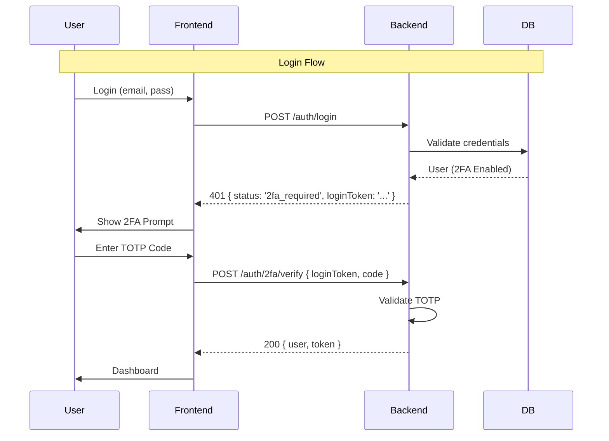

# 2FA Current State Map

## Overview

CraftCommand has a placeholder for 2FA in the UI (Header) but no backend implementation or data model support.

## Artifacts Identified

### Database Fields (Missing)

The `UserProfile` in `shared/types/index.ts` lacks:

- `twoFactorEnabled`: boolean
- `twoFactorSecret`: string (encrypted)
- `twoFactorRecoveryCodes`: string[] (hashed)

### API Endpoints (Missing)

The `auth.routes.ts` only has basic login. Missing:

- `POST /auth/2fa/verify`
- `POST /users/me/2fa/setup/start`
- `POST /users/me/2fa/setup/confirm`
- `POST /users/me/2fa/disable`

### Frontend UI (Partial/Placeholder)

- `Header.tsx`: Contains a "2FA Security" button in the user dropdown that does nothing.
- `UserProfile.tsx`: No 2FA management section.
- `Login.tsx`: No 2FA verification step.

### Middleware (Missing Enforcement)

- `authMiddleware.ts`: `verifyToken` does not check for 2FA requirement.

## Flow Diagram (Target)

