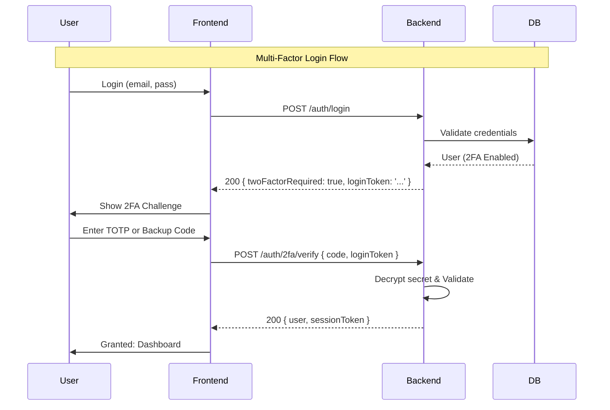

# 2FA Implementation Guide (v1.12.0)

## Overview

As of **v1.12.0**, Two-Factor Authentication (2FA) is a fully integrated, native feature of the CraftCommand security suite. This document replaces the previous placeholder warnings and details the actual production implementation.

## Implementation Details

### 1. Database Schema (`UserProfile`)
The `UserProfile` interface in `shared/types/index.ts` now includes:
- `twoFactorEnabled`: boolean (Master toggle)
- `twoFactorSecretEncrypted`: string (AES-256-CBC encrypted TOTP secret)
- `twoFactorBackupCodesHashed`: string[] (Bcrypt hashes of 10 recovery codes)
- `twoFactorVerifiedAt`: number (Timestamp of initial verification)

### 2. API Endpoints (`AuthService.ts`)
The backend provides a complete 2FA lifecycle:
- `POST /auth/2fa/setup/start`: Generates a new TOTP secret and QR code.
- `POST /auth/2fa/setup/confirm`: Validates the first code and generates recovery codes.
- `POST /auth/2fa/verify`: Validates TOTP or recovery codes during login.
- `POST /auth/2fa/disable`: Securely disables 2FA (requires password + code).

### 3. Frontend Integration
- **`UserProfile.tsx`**: Features a dedicated "Security" tab for 2FA management.
- **`Login.tsx`**: Includes a multi-stage login flow that intercepts `2fa_required` responses.
- **`Header.tsx`**: Displays a security shield icon for 2FA-enabled accounts.

### 4. Session Revocation
The system now tracks active sessions. Users can:
- View active login locations and devices.
- Revoke individual sessions (`jti` based).
- **Logout All Devices**: Instantly invalidates all active tokens for the account.

## Security Flow (v1.12.0)

---

_For data model specifics, see [2FA Data Model](2fa_data_model.md)._
